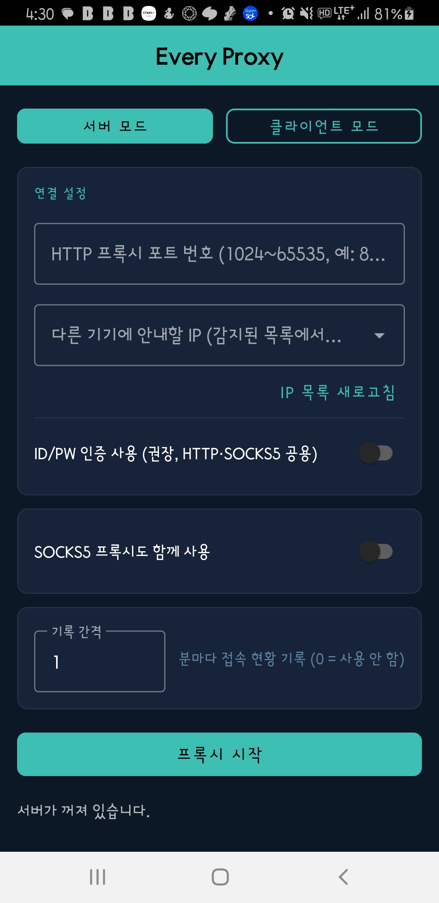
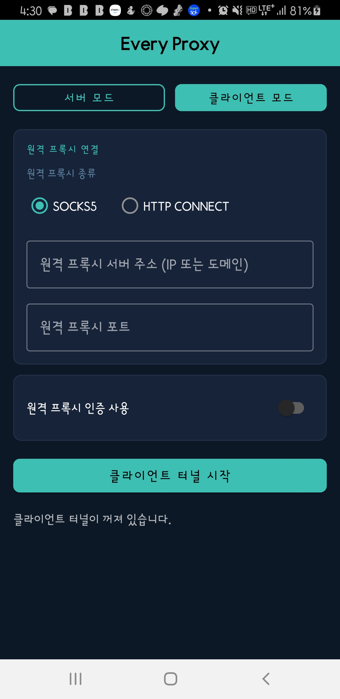

# Every Proxy 사용자 매뉴얼

| 항목 | 내용 |
|------|------|
| 앱 버전 | v1.2 |
| 최종 수정일 | 2026-08-01 |
| 대상 OS | Android 8.0 (API 26) 이상 |

> 스마트폰을 이동식 프록시 서버 또는 시스템 전체 터널 클라이언트로 활용하는 앱입니다.

---

## 목차

1. [앱 개요](#1-앱-개요)
2. [화면 구성](#2-화면-구성)
3. [서버 모드](#3-서버-모드)
4. [클라이언트 모드](#4-클라이언트-모드)
5. [두 폰 연동 시나리오](#5-두-폰-연동-시나리오)
6. [PC · 노트북 연결 방법](#6-pc--노트북-연결-방법)
7. [주의사항 및 자주 묻는 질문](#7-주의사항-및-자주-묻는-질문)

---

## 1. 앱 개요

| 모드 | 역할 | 대표 사용 예 |
|------|------|-------------|
| **서버 모드** | 이 폰을 HTTP / SOCKS5 프록시 서버로 실행 | 다른 기기(노트북·TV·태블릿)가 이 폰의 셀룰러 데이터를 경유해 인터넷에 접속 |
| **클라이언트 모드** | 이 폰의 모든 앱 트래픽을 원격 프록시로 터널링 | Phone 1이 서버, Phone 2가 클라이언트로 VPN 없이도 완전한 터널링 구현 |

> 두 모드는 **동시에 사용할 수 없습니다.** 서버가 실행 중이면 클라이언트 모드로 전환이 잠기고, 반대도 동일합니다.

---

## 2. 화면 구성

앱을 열면 상단에 **서버 모드 / 클라이언트 모드** 버튼이 표시됩니다.
선택된 모드는 청록색으로 채워지고, 해당 설정 화면만 아래에 나타납니다.

```
┌──────────────────────────────────────┐
│           Every Proxy                │  ← 앱 제목
├───────────────┬──────────────────────┤
│  서버 모드 ●  │    클라이언트 모드    │  ← 모드 선택
├───────────────┴──────────────────────┤
│  선택한 모드의 설정 화면              │
│  ...                                 │
│  [ 프록시 시작 / 클라이언트 터널 시작 ] │
│  상태 메시지                         │
└──────────────────────────────────────┘
```

---

## 3. 서버 모드

> 이 폰을 프록시 서버로 만들어, 같은 Wi-Fi · 핫스팟에 연결된 다른 기기들이 이 폰의 네트워크를 통해 인터넷에 접속하게 합니다.



### 3-1. 설정 항목

#### 연결 설정 카드

| 항목 | 설명 |
|------|------|
| **HTTP 프록시 포트 번호** | 다른 기기가 접속할 포트. 기본값 `8080`. 1024~65535 사이 값 입력 |
| **다른 기기에 안내할 IP** | 드롭다운에서 자동 감지된 IP를 선택하거나 직접 입력. 클라이언트 입장에서 빠를 것으로 예상되는 순서(핫스팟 IP 우선, 그 외는 실측 대역폭 순)로 정렬되어 표시됨 |
| **IP 목록 새로고침** | 네트워크 환경이 바뀌었을 때 IP 목록을 다시 스캔 |
| **ID/PW 인증 사용** | 켜면 아이디 · 비밀번호 입력란이 나타남. **같은 네트워크의 다른 사람이 무단 사용하지 못하도록 권장** |

#### SOCKS5 카드

| 항목 | 설명 |
|------|------|
| **SOCKS5 프록시도 함께 사용** | 켜면 SOCKS5 포트 입력란이 나타남. HTTP와 SOCKS5를 동시에 서비스 |

> SOCKS5 포트는 HTTP 포트와 **다른 번호**를 사용해야 합니다.

#### 스냅샷 기록 카드

| 항목 | 설명 |
|------|------|
| **기록 간격** | 입력한 분 간격마다 현재 접속 클라이언트 현황을 자동 기록. `0`이면 비활성화 |

> **예시**: 기록 간격을 `1`로 설정하면 서버가 실행되는 동안 1분마다 접속 현황이 기록됩니다. 다만 기록은 **최근 50건까지만** 보관되며, 51번째 기록이 추가되면 가장 오래된 기록부터 자동으로 삭제됩니다 (1분 간격 기준 최근 약 50분치 유지). 서버를 정지했다가 다시 시작하면 이전 기록은 모두 초기화됩니다.

### 3-2. 서버 시작 절차

1. **HTTP 포트** 번호 입력 (예: `8080`)
2. **IP** 드롭다운에서 핫스팟 또는 Wi-Fi IP 선택
3. (권장) **ID/PW 인증 사용** 켜고 아이디 · 비밀번호 설정
4. (선택) **SOCKS5** 켜고 포트 입력 (예: `1080`)
5. **프록시 시작** 버튼 탭
6. 상태 메시지에 `실행 중 — 다른 기기에서 [IP]:[포트]로 접속하세요` 표시 확인

### 3-3. 서버 실행 중 확인할 수 있는 정보

- 현재 접속 중인 SOCKS5 / HTTP 세션 수 및 클라이언트 호스트명 (2초마다 갱신)
- 스냅샷 기록 간격이 설정된 경우, 기록된 접속 현황 이력 목록

### 3-4. 서버 정지

- **프록시 정지** 버튼 탭
- 또는 상단 알림 바에서 **정지** 액션 탭

---

## 4. 클라이언트 모드

> 이 폰 자체의 모든 앱 트래픽을 원격 프록시 서버로 보냅니다. VPN 기반으로 동작하므로 브라우저, SNS, 스트리밍, 시스템 서비스까지 예외 없이 터널링됩니다.



### 4-1. 설정 항목

#### 원격 프록시 연결 카드

| 항목 | 설명 |
|------|------|
| **SOCKS5** | 원격 서버가 SOCKS5 프록시일 때 선택 (기본값) |
| **HTTP CONNECT** | 원격 서버가 HTTP 프록시일 때 선택. 내부에서 자동으로 SOCKS5↔HTTP 변환 |
| **원격 프록시 서버 주소** | 접속할 프록시 서버의 IP 또는 도메인 (예: `192.168.43.1`) |
| **원격 프록시 포트** | 프록시 서버의 포트 번호 (예: `8080` 또는 `1080`) |

#### 인증 카드

| 항목 | 설명 |
|------|------|
| **원격 프록시 인증 사용** | 켜면 아이디 · 비밀번호 입력란이 나타남. 서버에서 인증을 요구할 때 활성화 |

### 4-2. 클라이언트 시작 절차

1. 상단에서 **클라이언트 모드** 버튼 탭
2. 프록시 종류 선택: **SOCKS5** 또는 **HTTP CONNECT**
3. **원격 프록시 서버 주소** 입력 (예: Phone 1의 핫스팟 IP `192.168.43.1`)
4. **원격 프록시 포트** 입력 (예: `8080` 또는 `1080`)
5. 서버에서 인증을 사용하는 경우 **원격 프록시 인증 사용** 켜고 아이디 · 비밀번호 입력
6. **클라이언트 터널 시작** 버튼 탭
   - 버튼을 누르면 먼저 서버에 TCP 연결(3초 타임아웃)을 시도합니다
   - 연결 실패 시: 빨간색으로 오류 메시지 표시 → 주소 · 포트 확인 후 재시도
   - 연결 성공 시: 최초 1회(또는 다른 VPN 앱 사용 중일 때) 시스템 VPN 동의창이 뜸 → **허용** 탭
7. 상태 메시지에 `터널 실행 중 — [주소]:[포트]로 전체 트래픽이 나가고 있습니다` 표시 확인

### 4-3. 클라이언트 정지

- **클라이언트 터널 정지** 버튼 탭
- 또는 상단 알림 바에서 **정지** 탭

> **참고:** 터널이 실행 중인 동안 상태 표시줄에 열쇠(🔑) 아이콘이 표시됩니다.

---

## 5. 두 폰 연동 시나리오

가장 일반적인 사용 방식입니다.

```
[인터넷]
    ↑
[Phone 1 — Galaxy Note9]
  · LTE 셀룰러 데이터로 인터넷 연결
  · Wi-Fi 핫스팟 AP 역할
  · Every Proxy 서버 모드 실행
  · HTTP :8080  ·  SOCKS5 :1080
    ↑  (Wi-Fi 핫스팟)
[Phone 2 — Galaxy S23]
  · Phone 1 핫스팟에 Wi-Fi 연결
  · Every Proxy 클라이언트 모드 실행
  · 원격 프록시: 192.168.43.1 : 8080 (HTTP CONNECT)
  · 이 폰의 모든 트래픽 → Phone 1 → 인터넷
```

### 설정 순서

#### Phone 1 (서버)

1. **Wi-Fi 핫스팟 켜기** (설정 → 연결 → 모바일 핫스팟)
2. Every Proxy 실행 → **서버 모드** 선택
3. 포트 `8080` 입력, IP 드롭다운에서 핫스팟 IP 선택 (보통 `192.168.43.1`)
4. ID/PW 인증 권장 설정
5. **프록시 시작**

#### Phone 2 (클라이언트)

1. **Wi-Fi → Phone 1 핫스팟**에 연결
2. Every Proxy 실행 → **클라이언트 모드** 선택
3. 프록시 종류: **HTTP CONNECT**
4. 서버 주소: `192.168.43.1`, 포트: `8080`
5. Phone 1에서 인증을 설정했다면 동일한 ID/PW 입력
6. **클라이언트 터널 시작**

---

## 6. PC · 노트북 연결 방법

Phone 1의 핫스팟에 PC도 연결한 경우, PC에서도 프록시를 이용할 수 있습니다.

### Windows

1. 설정 → 네트워크 및 인터넷 → **프록시**
2. 수동 프록시 설정 켜기
3. 주소: `192.168.43.1`, 포트: `8080`

### macOS

1. 시스템 환경설정 → 네트워크 → 연결된 Wi-Fi → **고급** → 프록시 탭
2. **웹 프록시(HTTP)** 또는 **SOCKS 프록시** 체크
3. 주소: `192.168.43.1`, 포트: `8080` (또는 `1080`)

### Android (다른 기기)

설정 → Wi-Fi → 핫스팟 네트워크 길게 누르기 → **네트워크 수정** → 고급 → 프록시: **수동**
- 호스트: `192.168.43.1`
- 포트: `8080`

---

## 7. 주의사항 및 자주 묻는 질문

### 연결이 안 될 때

| 증상 | 점검 사항 |
|------|----------|
| 클라이언트 터널 시작 시 "서버 연결 실패" | 주소·포트 오탈자 확인 / Phone 1 서버가 실행 중인지 확인 / 같은 Wi-Fi · 핫스팟에 연결되어 있는지 확인 |
| PC에서 프록시 연결 거부 | 공유기의 **AP 격리(Client Isolation)** 기능 확인 → 켜져 있으면 기기 간 통신 차단됨. 핫스팟 사용 권장 |
| IP 드롭다운에 핫스팟 IP가 안 보임 | **IP 목록 새로고침** 버튼 탭 / 핫스팟을 먼저 켠 뒤 앱을 열었는지 확인 |
| 서버 모드 버튼이 비활성화됨 | 현재 클라이언트 터널이 실행 중 → 먼저 터널을 정지한 뒤 모드 전환 |

### 배터리 및 백그라운드

- 앱은 **포그라운드 서비스**로 동작하므로 알림 아이콘이 상시 표시됩니다.
- 제조사 절전 기능이 앱을 강제 종료할 수 있습니다. 배터리 설정에서 Every Proxy를 **"제한 없음"** 또는 절전 예외로 추가하세요.
- 서버 모드는 최대 **12시간** WakeLock을 유지합니다. 장시간 사용 시 충전 상태를 유지하세요.

### 보안

- 인증을 사용하지 않으면 **같은 네트워크의 누구나** 이 프록시를 사용할 수 있습니다. **ID/PW 인증 사용을 강력히 권장합니다.**
- 비밀번호는 기기 내부 앱 전용 저장소에 보관되며, 다른 앱은 접근할 수 없습니다.
- HTTPS 트래픽은 내용을 보지 않고 그대로 중계합니다(투명 터널링).

### 클라이언트 모드 — VPN 관련

- 클라이언트 터널은 Android VPN 기반으로 동작합니다. 최초 실행 시 시스템이 VPN 연결 동의를 요청합니다 → **허용** 해야 작동합니다.
- 다른 VPN 앱이 실행 중이면 충돌할 수 있습니다. Every Proxy 클라이언트를 시작하면 기존 VPN이 해제됩니다.
- 터널이 실행 중인 동안 상태 표시줄에 **열쇠(🔑)** 아이콘이 표시됩니다.

### 설정값 저장

모든 입력값(포트, IP, 인증 정보, 프로토콜, 스냅샷 간격)은 앱을 종료해도 자동으로 저장되며, 다음 실행 시 복원됩니다.
